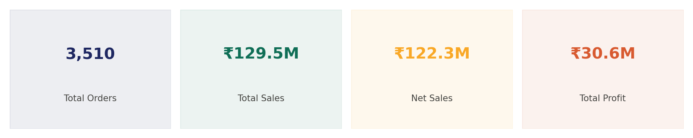
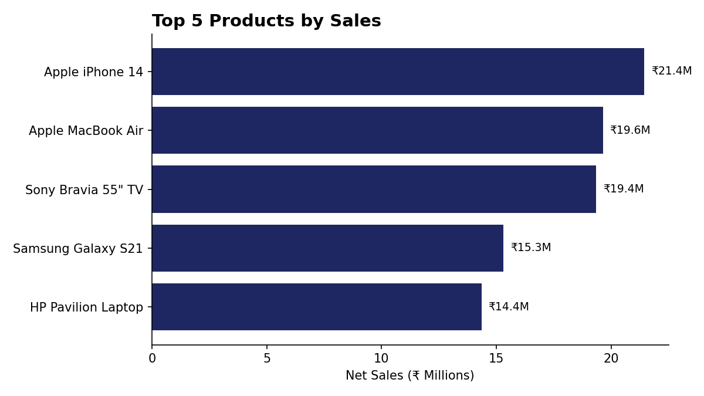
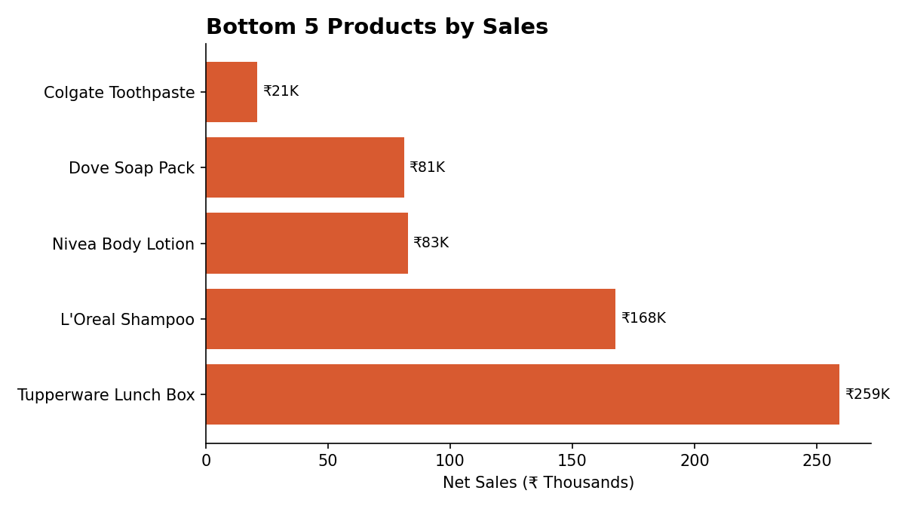
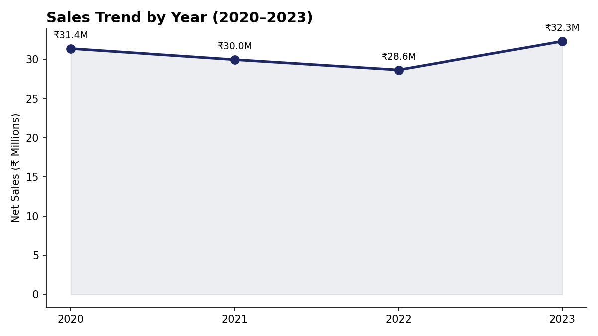
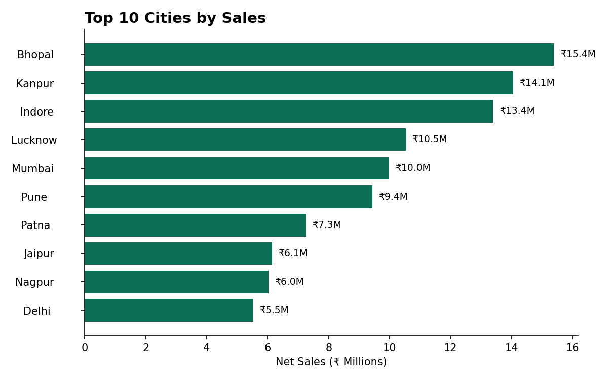
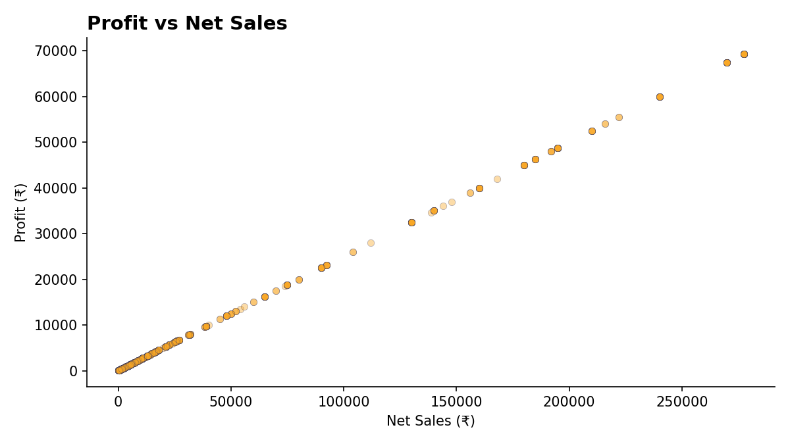
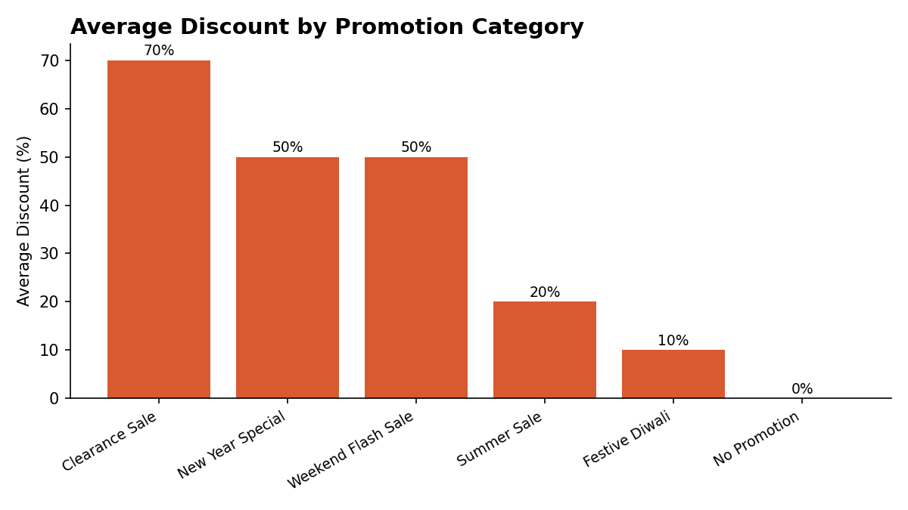

# ElectroHub — Sales Analysis Dashboard (Power BI)

An end-to-end Power BI project: cleaning raw multi-table retail sales data, building DAX measures, and designing a 5-page interactive dashboard to answer ElectroHub's core business questions on sales, profit, discounts, and customer trends.

## 📊 Project Overview

ElectroHub is a multi-category retailer (Electronics, Clothing, Footwear, Home Appliances, Accessories, Kitchenware, Bags, Personal Care). The raw transactional data arrived with key financial columns blank — `Price Per Unit`, `Total Sales`, `Discount`, and `Net Sales` were not pre-calculated and needed to be derived by joining the orders table against the Product and Promotion reference tables.

This project covers the full workflow: data cleaning → relational modeling → DAX measures → dashboard design.

## 📁 Files in this Repository

| File | Description |
|---|---|
| `ElectroHub_Sales_Analysis.pbix` | Power BI report file — open in Power BI Desktop for the full interactive dashboard |
| `store_data.xlsx` | Original raw source data (4 sheets: Customers, Product, Promotion, Orders) |
| `Cleaned_Sales_Data.xlsx` | Final cleaned & joined dataset with calculated Price, Total Sales, Discount, and Net Sales fields |
| `Power_BI_Project_1_Requirements.pptx` | Original project brief / business questions this dashboard answers |
| `images/` | Dashboard chart exports |

## 🗂️ Data Model

The source data follows a star-schema structure:

- **Dim Customers** — Customer ID, Name, City, State, Pincode, contact info (50 customers)
- **Dim Product** — Product ID, Name, Product Line, Price (30 products across 8 categories)
- **Dim Promotion** — Promotion ID, Name, Ad Type, Coupon Code, Discount Type (5 promotions)
- **Orders (fact table)** — Date, Customer ID, Promotion ID, Product ID, Units Sold (3,510 orders)

### Data Cleaning Steps
The orders table had **no pre-calculated values** for Price, Total Sales, Discount, or Net Sales — only IDs and Units Sold. To fix this:
1. Joined orders to `Dim Product` to pull in unit price
2. Joined orders to `Dim Promotion` to pull in each order's discount type (parsed text like "20% off" / "Buy 1 Get 1 Free" into a usable discount rate)
3. Calculated `Total Sales = Units Sold × Price`, `Discount Value = Total Sales × Discount %`, `Net Sales = Total Sales − Discount Value`
4. Built a `Profit` measure on top of Net Sales
5. Replaced blank PromotionIDs with "No Promotion" so every order is filterable consistently

## 📈 Dashboard Pages

**1. Overview**
- Sales trend line chart over time
- Profit vs Net Sales scatter plot
- Average discount by promotion (bar chart)
- Sales by city (map)
- Total order count (KPI card)

**2. Top / Bottom 5 Sales**
- Top 5 & Bottom 5 products by Sales
- Top 5 & Bottom 5 products by Quantity Sold
- Top 5 & Bottom 5 products by Profit

**3. Requirement Analysis (DAX measures)**
- Custom DAX measures: `Sum of Net Sales`, `Quantity Sold`, `Total Profit`
- Date range slicers to compare any two custom periods

**4. Period Comparison**
- Side-by-side Total Sales / Total Profit / Units Sold for two user-selected date ranges

**5. Order-Level Detail Table**
- Full filterable table — every order with Customer, Product, Promotion, Discount %, Profit, and Net Sales
- Slicers: Date, Customer Name, Product, Promotion

## ✅ Business Questions Answered

This dashboard was built to directly answer ElectroHub's brief:

1. Top/Bottom 5 products by Sales, Profit, and Quantity Sold
2. Sales trends over time (daily, monthly, quarterly, annually)
3. Relationship between sales and profit
4. Comparison of sales/profit/quantity between any two user-selected periods
5. Average discount offered per discount category
6. Total number of orders
7. Full order-level detail, filterable by Product, Date, Customer, and Promotion
8. Sales breakdown by city

## 🔍 Key Insights from the Data

- **3,510 total orders** generating **₹129.5M** in total sales and **₹122.3M** in net sales after discounts
- Top product by sales: **Apple iPhone 14** (₹21.4M), followed by **Apple MacBook Air** and **Sony Bravia 55" TV**
- Lowest-selling product: **Colgate Toothpaste** (~₹21K) — everyday low-ticket items sit far below electronics in revenue contribution
- **Bhopal, Kanpur, and Indore** are the top 3 cities by net sales
- Discount depth varies sharply by campaign — **Clearance Sale** averages 70% off vs. **Festive Diwali** at 10% off
- Electronics dominates revenue share despite being a smaller share of total unit volume, due to high price-per-unit

## 🖼️ Dashboard Visuals

**KPI Summary**

**Top 5 Products by Sales**

**Bottom 5 Products by Sales**

**Sales Trend by Year**

**Top 10 Cities by Sales**

**Profit vs Net Sales**

**Average Discount by Promotion**

## 🛠️ Tools Used

- **Power BI Desktop** — data modeling, relationships, DAX measures, report design
- **Excel** — source data storage and cleaning
- **DAX** — custom measures for sales, profit, and quantity aggregations

## 🚀 How to Use

1. Clone or download this repository
2. Open `ElectroHub_Sales_Analysis.pbix` in [Power BI Desktop](https://powerbi.microsoft.com/desktop/) (free)
3. Use the slicers on each page to filter by date, customer, product, or promotion
4. Navigate between the 5 report pages using the tabs at the bottom

## 📌 Future Improvements

- Add a true cost/COGS field to calculate exact profit margins instead of an estimated rate
- Add YoY and MoM growth indicators
- Publish to Power BI Service for a live shareable dashboard link

---

*This project uses a sample/synthetic retail transaction dataset for analytical and portfolio purposes.*
